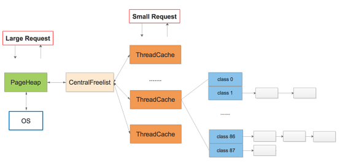
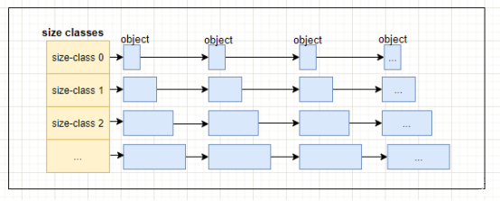
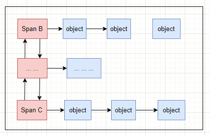
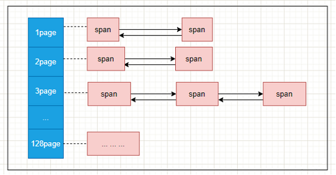
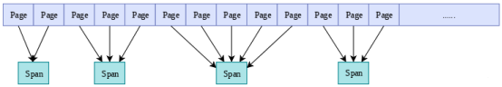
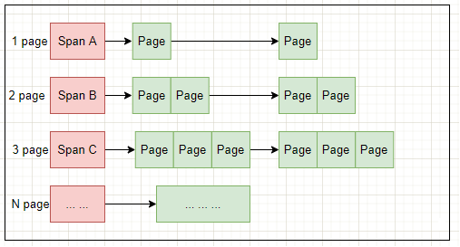

# 内存池
本项目旨在实现一个高并发的内存池，其灵感来源于Google开源项目tcmalloc。tcmalloc的全称为Thread-Caching Malloc，即线程缓存的malloc，它有效地管理了多线程下的内存分配，可用于替代系统提供的malloc和free函数。本项目基于tcmalloc的核心框架，经过（极度地）简化和模拟实现，实现了一个自己的mini版内存池。  
## 项目总览
仿照谷歌tcmalloc高并发内存池的架构，每个线程都有独立的线程缓存ThreadCache，线程的内存分配请求会向ThreadCache申请，ThreadCache内存不够用会向中央缓存CentralCache申请，CentralCache内存不够用时会向页堆PageHeap申请，PageHeap不够用就会向OS操作系统申请。    
  

#### 线程缓存 ThreadCache
ThreadCache是每个线程独立拥有的Cache，包含多个空闲内存链表（size classes），每一个链表（size-class）都有大小相同的object。  
线程可以从各自Thread Cache的FreeList获取对象，不需要加锁，所以速度很快。如果ThreadCache的FreeList为空，需要从CentralCache中的CentralFreeList中获取若干个object到ThreadCache对应的size class列表中，然后再取出其中一个object返回。 
  

内存块object
ThreadCache中定义很多个不同尺寸的内存块（称为object）规格，相同尺寸规格的内存块链接成一个可分配的FreeList. （在google的tcmalloc中称为size class）
在申请小内存时(小于256K)，内存池会根据申请内存大小映射到某个freelist中。比如，申请0到8个字节的大小时，会被映射到freelists[0]中，分配8个字节大小；申请9到16字节大小时，会被映射到freelists[1]中，分配16个字节大小，以此类推。

#### 中央缓存 CentralCache
中央缓存CentralCache是ThreadCache的缓存，ThreadCache内存不足时会向CentralCache申请。CentralCache本质是一组CentralFreeList，链表数量和ThreadCache数量相同。ThreadCache中内存过多时，可以放回CentralCache中。  
如果CentralFreeList中的object不够，CentralFreeList会向PageHeap申请一连串由Span组成的Page，并将申请的Page切割成一系列的object后，再将部分object转移给ThreadCache。
当申请的内存大于256K时，不在通过ThreadCache分配，而是通过PageHeap直接分配大内存。 
  

#### 页堆 PageHeap
页堆PageHeap保存存储Span的若干链表，CentralCache内存不足时，可以从PageHeap获取Span，然后把Span切割成object。  
PageHeap申请内存时按照Page申请，但管理内存的基本单位是Span，Span代表若干连续Page。  

PageHeap组织结构如下：
  

Span是PageHeap中管理内存Page的单位，由一个或多个连续的Page组成，比如2个Page组成的span，多个span使用链表来管理，内存池以Span为单位向操作系统申请内存。
第1个span包含2个page，第2个和第4个span包含3个page，第3个span包含5个page。
Span会记录起始page的PageID（start）以及所包含page的数量（length）。  

    

    

span中包含两个Span类型的指针（prev，next），用于将多个span以链表的形式存储。
（google tcmalloc中的Span有三种状态IN_USE, ON_NORMAL_FREELIST, ON_RETURNED_FREELIST. 本项目将其简化，用一个分配计数usecount来标识span当前有多少个内存块被分配。）  
  

## 项目参考
[关于内存池](https://www.geeksforgeeks.org/what-is-a-memory-pool/)  
[google的tcmalloc开源项目](https://github.com/google/tcmalloc/tree/master)  
[tcmalloc学习](https://blog.csdn.net/qq_40989769/article/details/136540173)  
[tcmalloc学习2](https://blog.csdn.net/weixin_45266730/article/details/131421670)  
[STL标准库的空间配置器allocator源码](https://gcc.gnu.org/onlinedocs/gcc-4.6.3/libstdc++/api/a00751_source.html)    
[几个内存池库的对比](https://blog.csdn.net/junlon2006/article/details/77854898)  

##  
